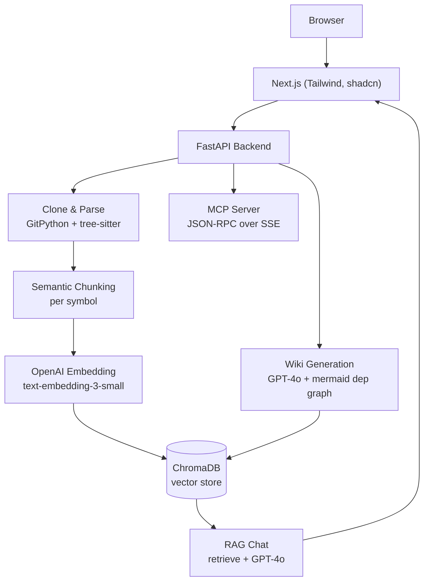

# DeepWiki

AI-powered wiki for any GitHub repository. Clone a repo, get auto-generated documentation, and ask questions grounded in its code.

## Quick start

```bash
# 1. Set your OpenAI key
cp backend/.env.example backend/.env
# edit backend/.env → set OPENAI_API_KEY

# 2. Start
docker compose up --build

# 3. Open http://localhost:3000
```

## Manual start

```bash
# Backend
cd backend
python -m venv .venv && source .venv/bin/activate
pip install -r requirements.txt
cp .env.example .env  # set OPENAI_API_KEY
uvicorn app.main:app --reload --port 8000

# Frontend (separate terminal)
cd frontend
npm install
npm run dev  # → http://localhost:3000
```

## Architecture



## Features

- GitHub repo clone & parse (tree-sitter, 10 languages)
- Semantic chunking per symbol
- Vector search (ChromaDB) + RAG chat (streaming SSE)
- Auto-generated wiki (5 sections, mermaid dep graph)
- MCP server (SSE, JSON-RPC 2.0)
- RAG eval framework
